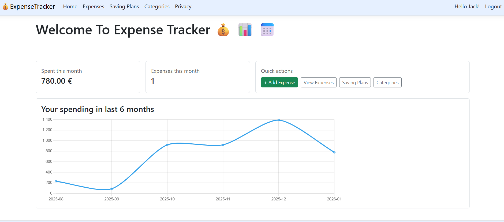
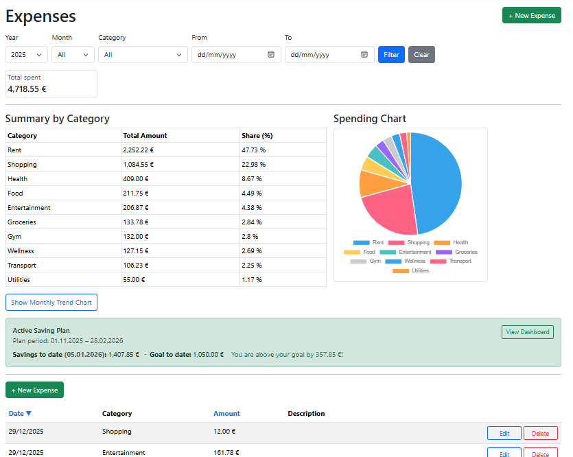
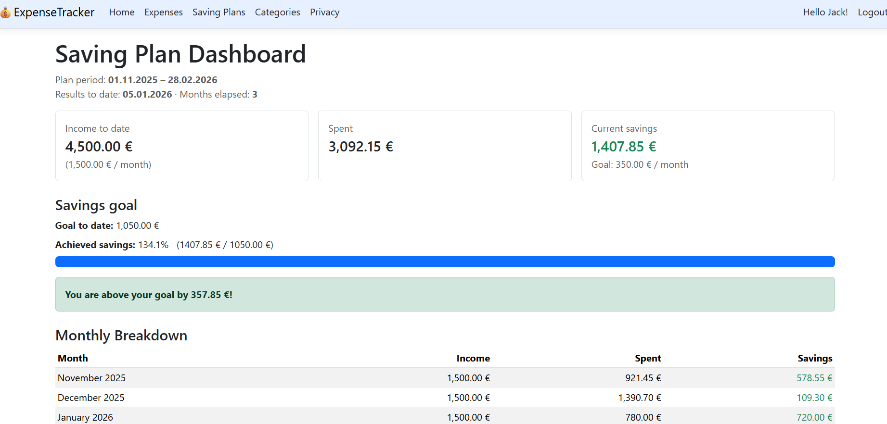

# Expense Tracker App

## Description

Expense Tracker App is a personal finance web application built with ASP.NET Core MVC that allows users to track expenses, analyze spending habits, and manage saving plans.

Key features include:
- Expense tracking with filtering, sorting, and pagination
- Category management 
- Saving plans with monthly breakdown and progress tracking
- Expense analytics (category summary and monthly trend charts)
- User authentication and personal data management

---

## Technologies

- ASP.NET Core MVC
- Entity Framework Core
- SQL Server
- ASP.NET Core Identity
- Bootstrap 5
- Chart.js

---

## Prerequisites

Before running the application, ensure you have:

- .NET SDK 9.0 or newer
- SQL Server (local or remote instance)
- Visual Studio 2022 or later

---

## Getting Started

- Clone the repository:
   ```
   git clone <repository-url>
	```
- Navigate to the project directory:
   ```
   cd ExpenseTrackerApp
   ```
- Update the database connection string in `appsettings.json` (see in configuration)

- Restore project dependencies:
   ```
   dotnet ef database update
   ```
- Apply database migrations:
   ```
   dotnet ef database update
   ```
- Run the application:
   ```
   dotnet run
   ```

---

## Configuration
- Update the connection string in `appsettings.json`:
	```
	"ConnectionStrings": {
		"DefaultConnection": "Server=YOUR_SERVER;Database=ExpenseTrackerDB;Trusted_Connection=True;MultipleActiveResultSets=true"
		}
	```

- Currency symbol can be configured in:
	```
	"AppSettings": {
    "CurrencySymbol": "€"
	}
	```
---

## Screenshots

### Home Page


### Expenses 


### Saving Plan Dashboard


---
	
		
	
